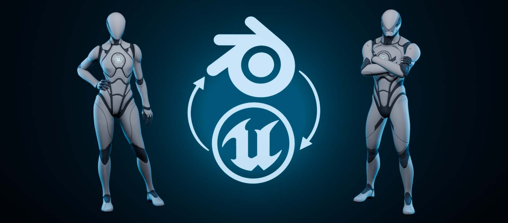

<h1 align="center">Mr Mannequins Tools</h1>

<h1 align="center">The Ultimate Blender Toolkit for Unreal Engine Characters</h1>

<h3 align="center"><strong>Mr Mannequins Tools is a free Blender add-on built to make working with Unreal Engine's Manny and Quinn fast and painless.</strong></h3>

But that's not all... Mr Mannequins Tools has grown far beyond its original purpose and now includes a wide set of tools for working with characters in Blender.

Alongside the core Manny and Quinn import/export workflow, you'll find tools for:

- **Fast, high-quality character rigging**
- **Custom character compatibility**
- **Armature, mesh and animation retargeting**
- **Mesh orientation for socket attachments**
- **Weighting and shape keys**
- **Mannequin-themed templates for prototyping**
- **General Blender To Unreal workflow utilities**

The goal is simple: **import your assets into Blender, edit them quickly and easily, then export them directly back without breaking anything.**

---

<h3 align="center"><strong>Update 5.0</strong></h3>

As of **Mr Mannequins Tools 5.0**, the previously separate add-ons have been merged back into one package.

Maintaining and updating everything separately was, quite frankly, annoying.

So if you're looking for one of the old standalone add-ons and wondering where it went: **it's in here now.**

**This update is huge** and there will be bugs, but I'll be doing my best to fix them as quickly as possible!

---

<h3 align="center"><strong>Services</strong></h3>

I’m often available for a variety of specialized freelance work!

- **Unreal Engine C++ & Blueprints**
- **Control Rigs, Rigging & Animation**
- **Blender Python & Custom Tools**
- **Character Modelling, Retopology & Weighting**
- **Multiplayer Replication & Gameplay Systems**
- **Pipelines, Workflows & Troubleshooting**

If your project needs something unusual, highly technical or painfully specific, get in touch.

---

<h3 align="center"><strong>Support</strong></h3>

Mr Mannequins Tools is a **free project**, so please don't expect dedicated one-to-one technical help unless you're supporting me on [**Patreon**](https://patreon.com/JimKroovy).

I absolutely will help where I can, but free support has to fit around my work commitments and actually developing the thing.

To report bugs and get Blender & Unreal support please join [**Mr Mannequins Server**](https://discord.gg/wkPZJaH) on Discord.

You can also get Mr Mannequins Tools on [**Superhive**](https://superhivemarket.com/products/mr-mannequins-tools) to give 10% of the proceeds to Blender.

Stay up to date with what I'm creating on [**YouTube**](https://www.youtube.com/c/JimKroovy), [**Twitter**](https://twitter.com/JimKroovy), [**Facebook**](https://www.facebook.com/JimKroovy) and [**Instagram**](https://www.instagram.com/jimkroovy).

---

<h3 align="center">Licensing</h3>

The Python source code included with Mr Mannequins Tools is distributed under the **GNU General Public License v3.0 or later**, in accordance with Blender's licensing requirements for add-ons using the Blender Python API.

Any **Epic Games or Unreal Engine assets** used or referenced by Mr Mannequins Tools remain the property of their respective owners and are subject to Epic Games' applicable licence terms.

Mr Mannequins Tools, its original rigging, tools and other original content are created by **Jim Kroovy**. Credit is always appreciated.